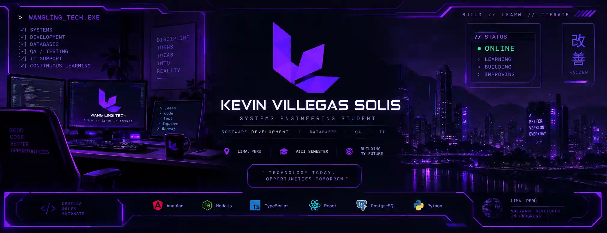
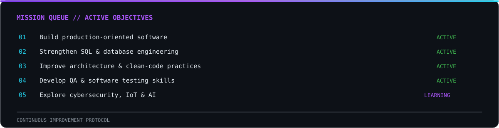

<!-- ============================================================= -->
<!--                                                               -->
<!--        WANGLING TECH // ENGINEERING PROFILE SYSTEM             -->
<!--               KEVIN VILLEGAS SOLIS                             -->
<!--                                                               -->
<!-- ============================================================= -->


<!-- ========================= HERO =============================== -->

<div align="center">



<br>




</div>


<!-- ====================== SYSTEM IDENTITY ======================= -->


## `01 // SYSTEM.IDENTITY`


### `> WHOAMI`

I'm **Kevin Villegas Solis**, a Systems Engineering student in Lima, Peru, currently completing the **VIII semester** of my degree.

My main focus is **software development**, with practical experience building and maintaining web applications and working with **JavaScript, TypeScript, Angular, React, Node.js, REST APIs, SQL and relational databases**.

My technical profile also includes **functional testing, software quality, troubleshooting and IT support**, while I continue expanding into **Information Security, IoT, Business Intelligence and Artificial Intelligence**.

```text
ROLE        // Systems Engineering Student
LOCATION    // Lima, Peru
FOCUS       // Software Development
SECONDARY   // Databases · QA · IT Systems
STATUS      // Building · Learning · Improving
```


<!-- ========================= ARSENAL ============================ -->


## `02 // TECH.ARSENAL`

<div align="center">

### `DEVELOPMENT CORE`


<br><br>

`JavaScript` • `TypeScript` • `Angular` • `React` • `Node.js` • `Express.js` • `HTML5` • `CSS3`

<br><br>

### `DATA & PERSISTENCE`


<br><br>

`PostgreSQL` • `MySQL` • `SQL Server` • `SQL` • `Prisma ORM`

<br><br>

### `ENGINEERING TOOLCHAIN`


<br><br>

`Git` • `GitHub` • `VS Code` • `Postman`

</div>

<br>

| `QUALITY ENGINEERING` | `IT & SYSTEMS` |
| :--- | :--- |
| Functional Testing | Windows |
| Exploratory Testing | PC Hardware |
| Issue Documentation | Software Installation |
| Browser DevTools | Troubleshooting |
| API Testing / Postman | Technical Support |
| ISO/IEC 25010 | System Configuration |


<!-- ======================= FEATURED SYSTEMS ===================== -->


## `03 // FEATURED.SYSTEMS`

<div align="center">

`SELECTED SOFTWARE ENGINEERING PROJECTS`

</div>

<br>

### `SYS.01 // ERP & POS MANAGEMENT`


**ERP / POS — Business Management System**

Full-stack system designed to centralize **sales, inventory, products, customers, reporting and operational management**.

`Angular` • `TypeScript` • `Node.js` • `PostgreSQL` • `REST API`

**Architecture focus:** modular business logic, persistence, transactional workflows and administrative interfaces.

<br>

---

### `SYS.02 // COMPUTER VISION`


**Peripheral Vision**

Computer vision system designed for automatic **detection and classification of IT peripherals** using image-processing techniques.

`Python` • `OpenCV` • `FastAPI` • `React` • `Machine Learning`

**Engineering focus:** image processing, HSV segmentation, detection pipelines and web integration.

<br>

---

### `SYS.03 // SECURITY MANAGEMENT`


**Smart Security Management System**

Platform for managing **residents, visitors, vehicles, access control and real-time notifications**.

`TypeScript` • `REST APIs` • `SSE`

**Engineering focus:** event-driven communication, security workflows and real-time system state.

<br>

---

### `SYS.04 // DIGITAL COMMERCE`


**Ferretería July — Interactive Catalog**

Responsive commercial experience featuring **product discovery, quick views, shopping cart, favorites and WhatsApp integration**.

`React` • `TypeScript` • `Vite` • `Tailwind CSS`

**Engineering focus:** responsive UI, state management and customer conversion flows.


<!-- ======================= WEB ARCHIVE ========================== -->


## `04 // WEB.PROJECT_ARCHIVE`

<table>

<tr>

<td width="50%" valign="top">

<h3 align="center"><code>BARBER STUDIO</code></h3>


<p align="center">
Responsive business landing page.
</p>

<p align="center">
<code>UI</code>
<code>Services</code>
<code>Appointments</code>
<code>Responsive</code>
</p>

</td>

<td width="50%" valign="top">

<h3 align="center"><code>BRASAS DEL SABOR</code></h3>


<p align="center">
Interactive restaurant website and digital catalog.
</p>

<p align="center">
<code>Catalog</code>
<code>Cart</code>
<code>WhatsApp</code>
<code>Maps</code>
</p>

</td>

</tr>

</table>


<!-- ========================= EXPERIENCE ========================= -->


## `05 // EXPERIENCE.LOG`

### `2026.04 ───────── 2026.08`

### **Web Development Intern**

**GRUPO LOOMSITE SOLUCIONES TI S.A.C.S.**

Worked on development and maintenance of **Landing Page, E-Commerce and E-Learning platforms**.

```diff
+ Web development and maintenance
+ Functional issue resolution
+ Visual issue resolution
+ Responsive validation
+ Cross-device compatibility
+ Technical improvements
```

**Production stack**

`HTML` • `CSS` • `JavaScript` • `WordPress` • `WooCommerce`

`STATUS // INTERNSHIP COMPLETED`


<!-- ======================== EDUCATION =========================== -->


## `06 // ACADEMIC.NETWORK`

### `UNIVERSIDAD CÉSAR VALLEJO`

**Systems Engineering**

`2023 ───────────────────────────── PRESENT`

`CURRENT LEVEL // VIII SEMESTER`

<br>

| `SOFTWARE QUALITY` | `SECURITY` | `IoT` | `DATA` |
| :---: | :---: | :---: | :---: |
| ISO/IEC 25010 | Risk Management | Microcontrollers | Business Intelligence |
| Quality Models | Information Security | Connected Systems | Data Warehouse |
| Functional Testing | Security Controls | IoT Architecture | Big Data |


<!-- ====================== CERTIFICATIONS ======================== -->


## `07 // CERTIFICATION.DATABASE`

| YEAR | ORGANIZATION | CERTIFICATION / TRAINING | STATUS |
| :---: | :--- | :--- | :---: |
| `2026` | Cisco Networking Academy | Computer Hardware Basics | `CERTIFIED` |
| `2026` | MTPE | Word & Excel for Work — Basic Level | `CERTIFIED` |
| `2025` | Universidad César Vallejo | Help Desk Assistant | `CERTIFIED` |
| `2025` | Universidad César Vallejo | Knowledge Management in the AI Era I & II | `COMPLETED` |


<!-- ========================== MISSION =========================== -->


## `08 // CURRENT.MISSION`




<!-- ======================== TELEMETRY =========================== -->


## `09 // SYSTEM.TELEMETRY`

<div align="center">

### `CONTRIBUTION STREAM`


<br>

`CODE`　•　`PROJECTS`　•　`EXPERIMENTS`　•　`CONTINUOUS LEARNING`

</div>


<!-- ========================= CONTACT ============================ -->


## `10 // CONNECTION.UPLINK`

<div align="center">

### `> READY FOR NEXT CHALLENGE_`

Interested in opportunities involving **Software Development, Systems, Databases, QA and IT**.

<br>

<a href="mailto:kevinvillegas.dev@gmail.com">

</a>

<a href="https://www.linkedin.com/in/kevin-villegas-solis-7b0038366/">

</a>

<a href="https://github.com/wanglingtech">

</a>

<br><br>


</div>


<!-- ========================== FOOTER ============================ -->

<br>


<div align="center">

<sub>
Kevin Villegas Solis · Systems Engineering · Lima, Peru
</sub>

</div>