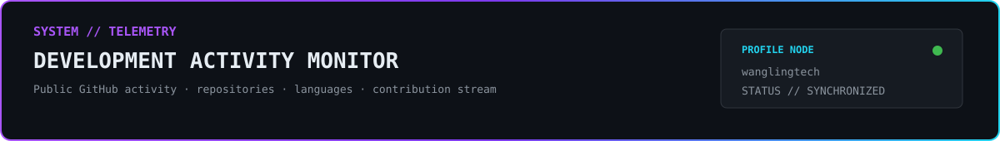
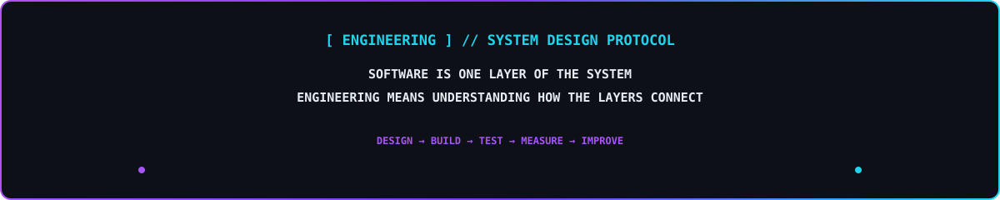

<!-- ============================================================ -->
<!-- WANGLING TECH // ENGINEERING PROFILE                         -->
<!-- KEVIN VILLEGAS SOLIS                                        -->
<!-- ============================================================ -->

 

<!-- ============================================================ -->
<!-- 01 // SYSTEM.IDENTITY                                       -->
<!-- ============================================================ -->

 

<!-- ============================================================ -->
<!-- 02 // TECH.ARSENAL                                          -->
<!-- ============================================================ -->

### `CORE // DEVELOPMENT`

  

### `DATA // PERSISTENCE`

 

`PostgreSQL`　•　`MySQL`　•　`SQL Server`　•　`SQL`　•　`Prisma ORM`

  

### `ENGINEERING // TOOLCHAIN`

  

### `DEPLOYMENT // PLATFORM`

 

 

 

<!-- ============================================================ -->
<!-- 03 // FEATURED.SYSTEMS                                      -->
<!-- ============================================================ -->

### `SELECTED // ENGINEERING PROJECTS`

`FULL STACK`　•　`COMPUTER VISION`　•　`REAL-TIME SYSTEMS`　•　`WEB ENGINEERING`

 

<!-- PROJECT 01 -->

 

 

`Sales`　`Inventory`　`Products`　`Customers`　`Reports`　`Dashboard`

  

 

---

<!-- PROJECT 02 -->

 

 

`Detection`　`Image Processing`　`HSV Segmentation`　`Classification`

  

 

---

<!-- PROJECT 03 -->

 

 

`Residents`　`Visitors`　`Vehicles`　`Access Control`　`Events`

  

 

---

<!-- PROJECT 04 -->

 

 

`Catalog`　`Search`　`Quick View`　`Cart`　`Favorites`　`WhatsApp`

  

<!-- ============================================================ -->
<!-- 04 // WEB.PROJECT_ARCHIVE                                   -->
<!-- ============================================================ -->

### `COMMERCIAL // WEB INTERFACES`

`RESPONSIVE DESIGN`　•　`BUSINESS UI`　•　`DIGITAL COMMERCE`

 

<table>
<tr>

<td width="50%" valign="top">

<h3 align="center">
<code>WEB // 01</code> 
BARBER STUDIO
</h3>

Responsive business landing experience.

<code>UI</code>
<code>Services</code>
<code>Appointments</code>
<code>Responsive</code>

</td>

<td width="50%" valign="top">

<h3 align="center">
<code>WEB // 02</code> 
BRASAS DEL SABOR
</h3>

Interactive restaurant website and digital catalog.

<code>Catalog</code>
<code>Cart</code>
<code>WhatsApp</code>
<code>Maps</code>

</td>

</tr>
</table>

<!-- ============================================================ -->
<!-- 05 // EXPERIENCE.LOG                                        -->
<!-- ============================================================ -->

### `PRODUCTION // TECHNOLOGIES`

  

`HTML`　•　`CSS`　•　`JavaScript`　•　`WordPress`　•　`WooCommerce`

<!-- ============================================================ -->
<!-- 06 // ACADEMIC.NETWORK                                      -->
<!-- ============================================================ -->

### `SYSTEMS ENGINEERING // UNIVERSIDAD CÉSAR VALLEJO`

`2023 ━━━━━━━━━━━━━━━━━━━━━━━━━ PRESENT`

`CURRENT LEVEL // VIII SEMESTER`

 

<!-- ============================================================ -->
<!-- 07 // CERTIFICATION.DATABASE                                -->
<!-- ============================================================ -->

<!-- ============================================================ -->
<!-- 08 // CURRENT.MISSION                                       -->
<!-- ============================================================ -->

<!-- ============================================================ -->
<!-- 09 // SYSTEM.TELEMETRY                                      -->
<!-- ============================================================ -->

 

### `STREAK // CONSISTENCY`

  

### `PROFILE // SUMMARY MATRIX`

 

  

### `CONTRIBUTION // MATRIX`

  

### `CONTRIBUTION // STREAM`

 

`COMMITS`　•　`PROJECTS`　•　`EXPERIMENTS`　•　`CONTINUOUS DEVELOPMENT`

<!-- ============================================================ -->
<!-- 10 // ENGINEERING.SIGNAL                                    -->
<!-- ============================================================ -->

 

<!-- ============================================================ -->
<!-- 11 // CONNECTION.UPLINK                                     -->
<!-- ============================================================ -->

 

  

<!-- ============================================================ -->
<!-- FOOTER                                                      -->
<!-- ============================================================ -->

 

Kevin Villegas Solis · Systems Engineering · Lima, Peru

 

WangLing Tech // Build · Learn · Iterate

