<!-- WANGLING TECH // CYBERPUNK ENGINEERING INTERFACE -->

<!-- 01 // SYSTEM.IDENTITY -->


<!-- 02 // TECH.ARSENAL -->

<!-- 03 // FEATURED.SYSTEMS -->
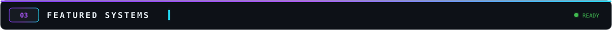

 

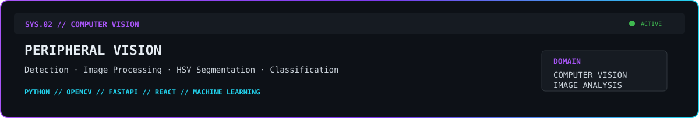

 

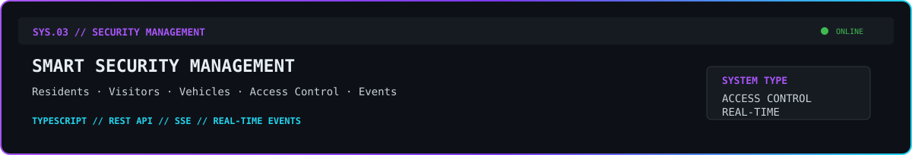

 

 

<!-- 04 // WEB.PROJECT_ARCHIVE -->
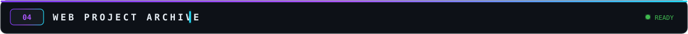

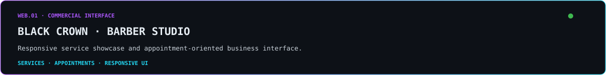
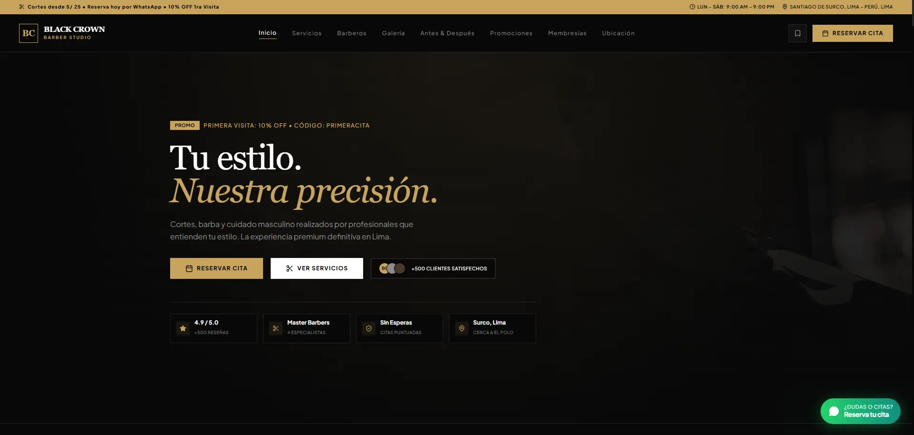

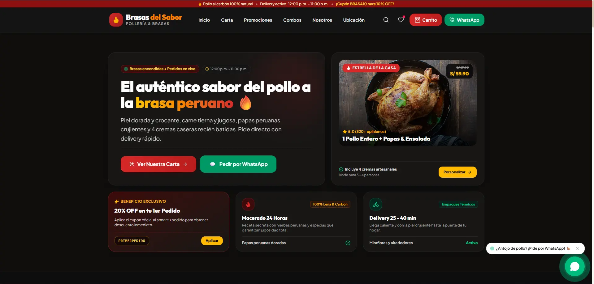

<!-- 05 // EXPERIENCE.LOG -->
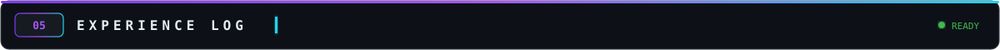
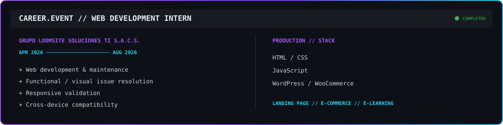

<!-- 06 // ACADEMIC.NETWORK -->
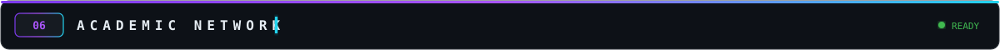
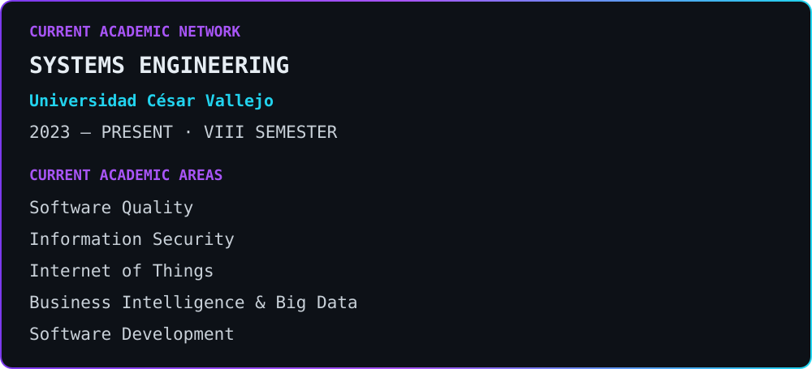

<!-- 07 // CERTIFICATION.DATABASE -->

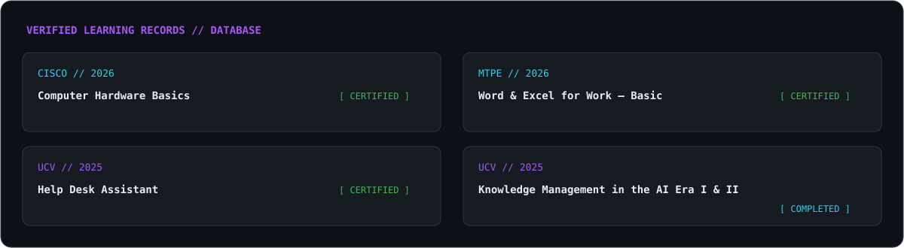

<!-- 08 // CURRENT.MISSION -->
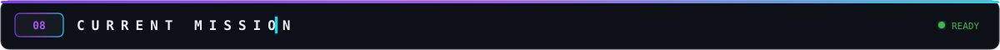

<!-- 09 // DIGITAL.ECOSYSTEM -->

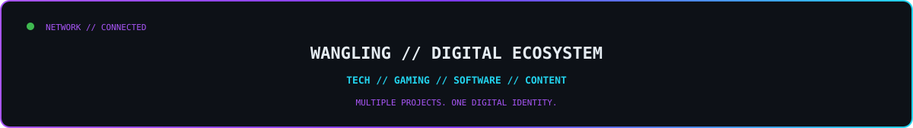

<h3>WANGLING TECH // PRIMARY NODE</h3>
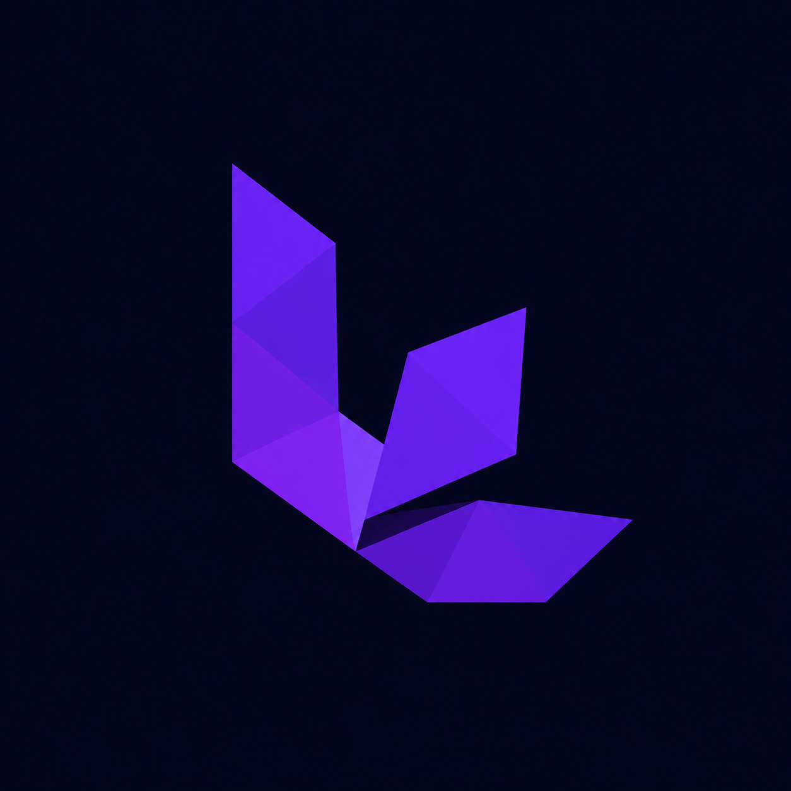

Software development and digital solutions.

<h4>WANGLING GAMING // SECONDARY PROJECT</h4>

Gaming platform connecting videos, community and interactive content.

<!-- 10 // VELYXORA -->

<!-- 11 // SYSTEM.TELEMETRY -->

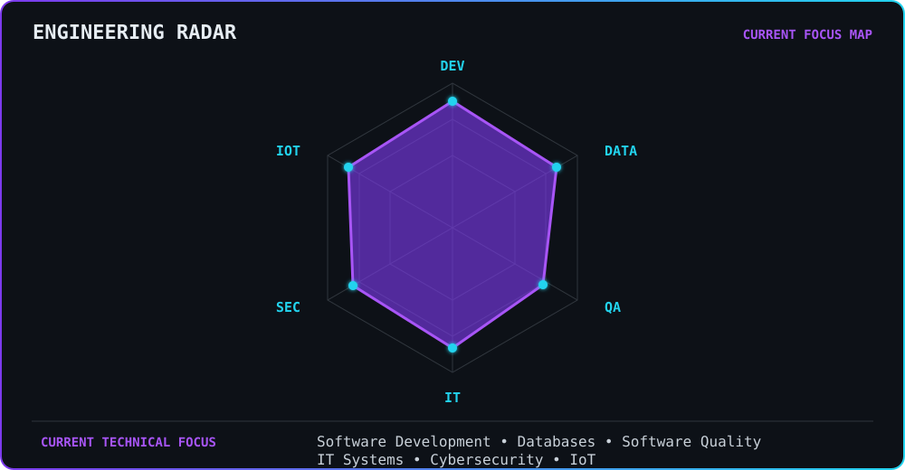
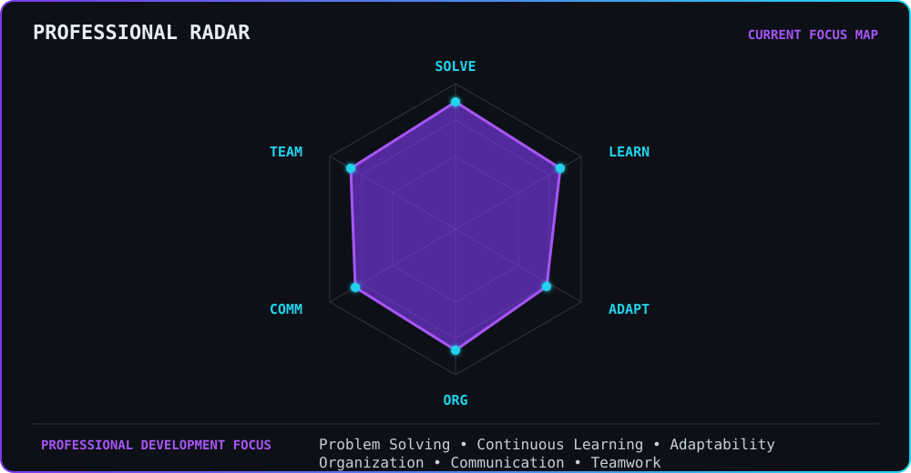

<!-- 12 // CONNECTION.UPLINK -->

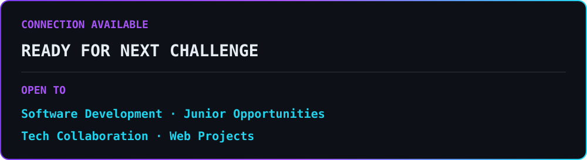

