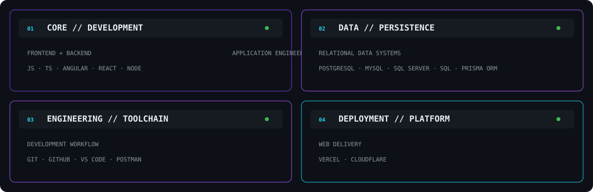

<!-- ============================================================ -->
<!-- WANGLING TECH // ENGINEERING PROFILE                         -->
<!-- KEVIN VILLEGAS SOLIS                                        -->
<!-- ============================================================ -->

 

<!-- ============================================================ -->
<!-- 01 // SYSTEM.IDENTITY                                       -->
<!-- ============================================================ -->

 

<!-- ============================================================ -->
<!-- 02 // TECH.ARSENAL                                          -->
<!-- ============================================================ -->

 

<table>
<tr>
<td width="50%" align="center">

</td>

<td width="50%" align="center">

</td>
</tr>

<tr>
<td width="50%" align="center">

</td>

<td width="50%" align="center">

</td>
</tr>
</table>

 

 

 

<!-- ============================================================ -->
<!-- 03 // FEATURED.SYSTEMS                                      -->
<!-- ============================================================ -->

 

<!-- ERP POS -->

  

 

<!-- PERIPHERAL VISION -->

  

 

<!-- SECURITY -->

  

 

<!-- FERRETERIA -->

  

<!-- ============================================================ -->
<!-- 04 // WEB.PROJECT_ARCHIVE                                   -->
<!-- ============================================================ -->

 

 

<!-- ============================================================ -->
<!-- 05 // EXPERIENCE.LOG                                        -->
<!-- ============================================================ -->

 

 

<!-- ============================================================ -->
<!-- 06 // ACADEMIC.NETWORK                                      -->
<!-- ============================================================ -->

<!-- ============================================================ -->
<!-- 07 // CERTIFICATION.DATABASE                                -->
<!-- ============================================================ -->

<!-- ============================================================ -->
<!-- 08 // CURRENT.MISSION                                       -->
<!-- ============================================================ -->

<!-- ============================================================ -->
<!-- DIGITAL // ECOSYSTEM                                        -->
<!-- ============================================================ -->

 

<table>
<tr>

<td width="50%" align="center" valign="top">

<h3>WangLing Tech</h3>

  

Software development, web solutions and digital systems for businesses.

  

  

</td>

<td width="50%" align="center" valign="top">

<h3>WangLing Gaming</h3>

  

Gaming platform connecting videos, community and interactive content.

  

  

</td>

</tr>
</table>

 

 

<!-- ============================================================ -->
<!-- VELYXORA // ACTIVE DEVELOPMENT                              -->
<!-- ============================================================ -->

 

### `VELYXORA // ACTIVE DEVELOPMENT`

Authentication-oriented full-stack application currently under iterative development.

  

<!-- ============================================================ -->
<!-- 09 // SYSTEM.TELEMETRY                                      -->
<!-- ============================================================ -->

 

  

 

  

  

<!-- ============================================================ -->
<!-- 10 // ENGINEERING.SIGNAL                                    -->
<!-- ============================================================ -->

<!-- ============================================================ -->
<!-- 11 // CONNECTION.UPLINK                                     -->
<!-- ============================================================ -->

 

  

 

Kevin Villegas Solis · Systems Engineering · Lima, Peru

 

WangLing Tech // Build · Learn · Iterate

