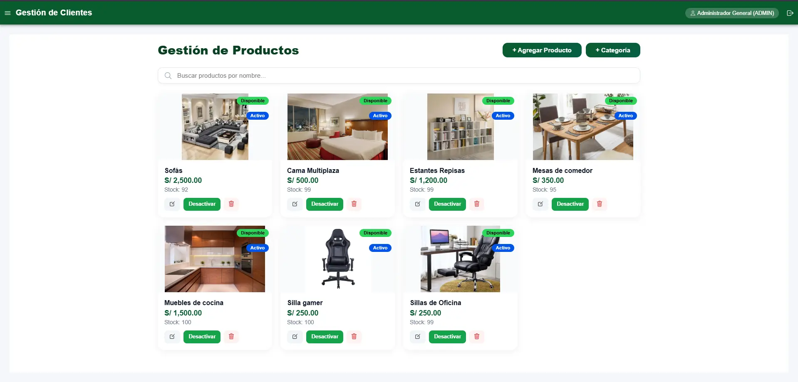
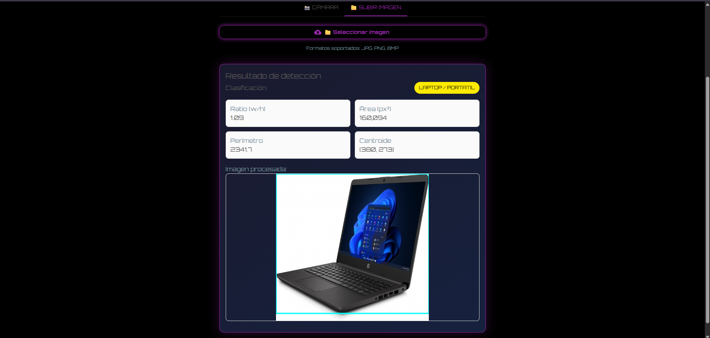
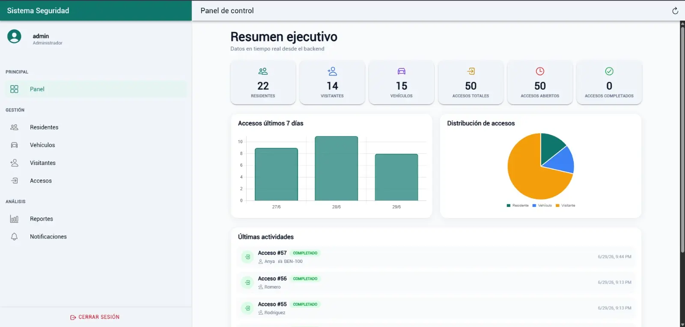
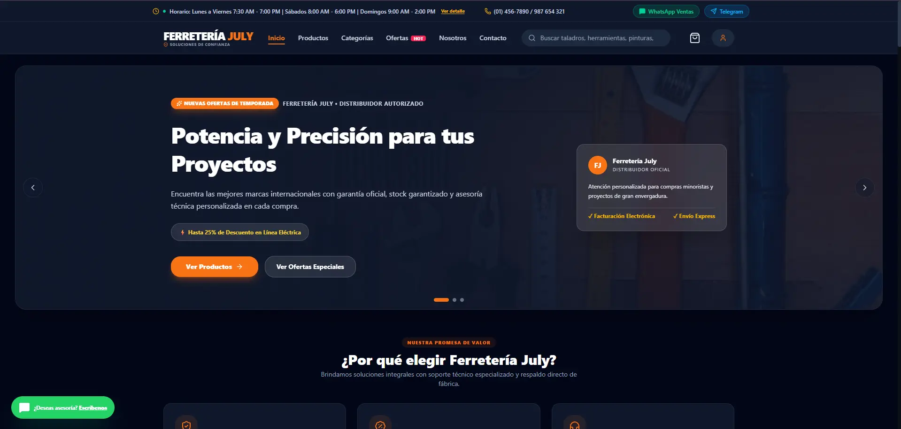

<!-- =============================================================== -->
<!--                                                                 -->
<!--              WANGLING TECH // SYSTEM PROFILE                    -->
<!--                   KEVIN VILLEGAS SOLIS                           -->
<!--                                                                 -->
<!-- =============================================================== -->

<!-- ========================= HERO ================================ -->

<div align="center">


<br>


<br>

### `SYSTEMS ENGINEERING // SOFTWARE DEVELOPMENT`

`LIMA // PERU`　•　`VIII SEMESTER`　•　`SYSTEM // ONLINE`

<br>


</div>

<!-- ======================== IDENTITY ============================== -->

## `01 // SYSTEM.IDENTITY`

<table>
<tr>

<td width="58%" valign="top">

### `> PROFILE.EXE`

I'm **Kevin Villegas Solis**, a Systems Engineering student focused on **software development and information technology**.

I have practical experience in **web development and maintenance**, working with Landing Pages, E-Commerce and E-Learning platforms.

My technical foundation includes **JavaScript, TypeScript, Angular, React, Node.js, REST APIs, SQL and relational databases**, complemented by knowledge of **functional testing, IT support and troubleshooting**.

Currently expanding my knowledge through academic and personal projects involving **Software Quality, Information Security, IoT, Business Intelligence and Big Data**.

</td>

<td width="42%" valign="top">

```yaml
USER: Kevin Villegas Solis

ROLE: Systems Engineering Student

LEVEL: VIII Semester

LOCATION: Lima, Peru

PRIMARY: Software Development

SECONDARY: Databases
  QA
  IT

STATUS: ACTIVE
```

</td>

</tr>
</table>

<div align="center">

`SYS://ONLINE`　　`MODE://BUILDING`　　`LEARNING://ENABLED`

</div>

<br>


<!-- ========================== STACK =============================== -->

## `02 // TECH.ARSENAL`

<div align="center">

### `CORE // DEVELOPMENT`

<br>


<br><br>

`JavaScript`　•　`TypeScript`　•　`Angular`　•　`React`  
`Node.js`　•　`Express.js`　•　`HTML5`　•　`CSS3`

<br><br>

### `DATA // PERSISTENCE`

<br>


<br><br>

`PostgreSQL`　•　`MySQL`　•　`SQL Server`　•　`SQL`　•　`Prisma ORM`

<br><br>

### `TOOLS // ENVIRONMENT`

<br>


<br><br>

`Git`　•　`GitHub`　•　`VS Code`　•　`Postman`

</div>

<br>

<table>

<tr>

<td width="50%" valign="top">

### `QUALITY.NODE`

```diff
+ Functional Testing
+ Exploratory Testing
+ Issue Documentation
+ Browser DevTools
+ API Testing / Postman
+ ISO/IEC 25010
```

</td>

<td width="50%" valign="top">

### `SYSTEM.NODE`

```diff
+ Windows
+ PC Hardware
+ Software Installation
+ Troubleshooting
+ Technical Support
+ System Configuration
```

</td>

</tr>

</table>

<br>


<!-- ========================= PROJECTS ============================== -->

## `03 // FEATURED.SYSTEMS`

<div align="center">

### `SELECTED DEVELOPMENT WORK`

`REAL PROJECTS // REAL INTERFACES // CONTINUOUS IMPROVEMENT`

<br>

</div>

<!-- ========================= PROJECT 001 ========================== -->

<table>

<tr>

<td width="58%" valign="middle">

<a href="https://github.com/wanglingtech/muebleria-pos">

</a>

</td>

<td width="42%" valign="top">

### `SYSTEM // 001`

## ERP / POS — Mueblería

Business management system designed to centralize sales and operational processes.

**CORE MODULES**

`Sales` `Inventory` `Products`

`Customers` `Reports` `Dashboard`

**TECH**

`Angular` `TypeScript`

`Node.js` `PostgreSQL`

`REST API`

```text
CLASS  // ERP / POS
LAYER  // FULL STACK
STATE  // OPERATIONAL
```

<a href="https://github.com/wanglingtech/muebleria-pos">

</a>

</td>

</tr>

</table>

<br>

<!-- ========================= PROJECT 002 ========================== -->

<table>

<tr>

<td width="42%" valign="top">

### `SYSTEM // 002`

## Peripheral Vision

Computer vision system for automatic detection and classification of IT peripherals.

**CAPABILITIES**

`Computer Vision`

`Object Detection`

`HSV Segmentation`

`Image Processing`

**TECH**

`Python` `OpenCV`

`FastAPI` `React`

`Machine Learning`

```text
CLASS  // COMPUTER VISION
LAYER  // AI / WEB
STATE  // EXPERIMENTAL
```

<a href="https://github.com/wanglingtech/computer-vision-peripheral-detector">

</a>

</td>

<td width="58%" valign="middle">

<a href="https://github.com/wanglingtech/computer-vision-peripheral-detector">

</a>

</td>

</tr>

</table>

<br>

<!-- ========================= PROJECT 003 ========================== -->

<table>

<tr>

<td width="58%" valign="middle">

<a href="https://github.com/wanglingtech/sistema_seguridad">

</a>

</td>

<td width="42%" valign="top">

### `SYSTEM // 003`

## Security Management

Platform for residential security administration and real-time event monitoring.

**MODULES**

`Residents` `Visitors`

`Vehicles` `Access Control`

`Notifications`

**TECH**

`TypeScript`

`REST APIs`

`SSE`

```text
CLASS  // SECURITY SYSTEM
MODE   // REAL-TIME
STATE  // OPERATIONAL
```

<a href="https://github.com/wanglingtech/sistema_seguridad">

</a>

</td>

</tr>

</table>

<br>

<!-- ========================= PROJECT 004 ========================== -->

<table>

<tr>

<td width="42%" valign="top">

### `SYSTEM // 004`

## Ferretería July

Interactive commercial catalog designed for the digital presence of a local hardware business.

**FEATURES**

`Product Search`

`Quick View`

`Shopping Cart`

`Favorites`

`WhatsApp Integration`

**TECH**

`React` `TypeScript`

`Vite` `Tailwind CSS`

```text
CLASS  // WEB COMMERCE
UI     // RESPONSIVE
STATE  // DEPLOYED
```

<a href="https://github.com/wanglingtech/LandingPage_Ferreteria">

</a>

</td>

<td width="58%" valign="middle">

<a href="https://github.com/wanglingtech/LandingPage_Ferreteria">

</a>

</td>

</tr>

</table>

<br>


<!-- ======================= PROJECT ARCHIVE ======================== -->

## `04 // WEB.PROJECT_ARCHIVE`

<div align="center">

`ADDITIONAL WEB DEVELOPMENT PROJECTS`

<br><br>

<table>

<tr>

<td width="50%" align="center" valign="top">

### `BARBER // STUDIO`


<br>

Responsive landing page for a barber business.

<br><br>

`Responsive UI`　•　`Services`　•　`Appointments`

<br><br>

<a href="https://github.com/wanglingtech/Landing_Page_BarberStudio">

</a>

</td>

<td width="50%" align="center" valign="top">

### `BRASAS // DEL SABOR`


<br>

Interactive restaurant landing page and digital catalog.

<br><br>

`Catalog`　•　`Cart`　•　`WhatsApp`　•　`Maps`

<br><br>

<a href="https://github.com/wanglingtech/LandingPage_Polleria">

</a>

</td>

</tr>

</table>

</div>

<br>


<!-- ======================== EXPERIENCE ============================ -->

## `05 // EXPERIENCE.LOG`

<table>

<tr>

<td width="28%" valign="middle" align="center">

### `CAREER.EVENT`

```text
2026.04
   │
   │
   ▼
2026.08

COMPLETED
```

</td>

<td width="72%" valign="top">

### `WEB DEVELOPMENT INTERN`

**GRUPO LOOMSITE SOLUCIONES TI S.A.C.S.**

`APR 2026 ───────────────────────────── AUG 2026`

Participated in the development and maintenance of **Landing Page, E-Commerce and E-Learning platforms**.

```diff
+ Web development and maintenance
+ Functional issue resolution
+ Visual issue resolution
+ Responsive validation
+ Cross-device compatibility
+ Technical improvements
```

**PRODUCTION STACK**

`HTML` • `CSS` • `JavaScript` • `WordPress` • `WooCommerce`

</td>

</tr>

</table>

<br>


<!-- ========================= ACADEMIC ============================= -->

## `06 // ACADEMIC.NETWORK`

```text
2023
 │
 ●──── SYSTEMS ENGINEERING
 │     Universidad César Vallejo
 │
 │
2025
 │
 ●──── HELP DESK ASSISTANT
 │     Intermediate Certification
 │
 │
2026.04
 │
 ●──── WEB DEVELOPMENT INTERNSHIP
 │     Grupo Loomsite Soluciones TI
 │
2026.08
 │
 ●──── INTERNSHIP COMPLETED
 │
2026.09
 │
 ●──── VIII SEMESTER
 │
 ▼
CURRENT
```

<br>

### `CURRENTLY.EXPLORING`

<table>

<tr>

<td width="25%" align="center" valign="top">

### `QUALITY`

**ISO/IEC 25010**

Software Quality Models

Functional Testing

</td>

<td width="25%" align="center" valign="top">

### `SECURITY`

**Risk Management**

Information Security

Security Controls

</td>

<td width="25%" align="center" valign="top">

### `IoT`

**Microcontrollers**

Connected Systems

IoT Architecture

</td>

<td width="25%" align="center" valign="top">

### `DATA`

**Business Intelligence**

Data Warehouse

Big Data

</td>

</tr>

</table>

<br>


<!-- ====================== CERTIFICATIONS ========================== -->

## `07 // CERTIFICATION.DATABASE`

<table>

<tr>

<td width="50%" valign="top">

### `CISCO // 2026`

#### Computer Hardware Basics

Cisco Networking Academy

`STATUS // CERTIFIED`

</td>

<td width="50%" valign="top">

### `MTPE // 2026`

#### Word & Excel for Work

Basic Level

Ministerio de Trabajo y Promoción del Empleo

`STATUS // CERTIFIED`

</td>

</tr>

<tr>

<td width="50%" valign="top">

### `UCV // 2025`

#### Help Desk Assistant

Intermediate Certification

Universidad César Vallejo

`STATUS // CERTIFIED`

</td>

<td width="50%" valign="top">

### `UCV // 2025`

#### Knowledge Management in the AI Era

Modules I & II

Universidad César Vallejo

`STATUS // COMPLETED`

</td>

</tr>

</table>

<br>


<!-- ========================= MISSION ============================== -->

## `08 // CURRENT.MISSION`

<table>

<tr>
<td align="center"><code>01</code></td>
<td><strong>Build</strong> production-oriented software projects</td>
<td align="center"><code>ACTIVE</code></td>
</tr>

<tr>
<td align="center"><code>02</code></td>
<td>Strengthen <strong>SQL & database engineering</strong></td>
<td align="center"><code>ACTIVE</code></td>
</tr>

<tr>
<td align="center"><code>03</code></td>
<td>Improve <strong>software architecture</strong> practices</td>
<td align="center"><code>ACTIVE</code></td>
</tr>

<tr>
<td align="center"><code>04</code></td>
<td>Develop <strong>QA & software testing</strong> skills</td>
<td align="center"><code>ACTIVE</code></td>
</tr>

<tr>
<td align="center"><code>05</code></td>
<td>Explore <strong>Cybersecurity, IoT & AI</strong></td>
<td align="center"><code>LEARNING</code></td>
</tr>

<tr>
<td align="center"><code>06</code></td>
<td>Prepare for <strong>Software / IT opportunities</strong></td>
<td align="center"><code>ACTIVE</code></td>
</tr>

</table>

<br>


<!-- ========================= TELEMETRY ============================ -->

## `09 // SYSTEM.TELEMETRY`

<div align="center">

### `GITHUB // ACTIVITY MATRIX`

<br>


<br><br>

### `CONTRIBUTION // STREAM`

<br>


<br>

`COMMITS`　•　`PROJECTS`　•　`LEARNING`　•　`CONTINUOUS DEVELOPMENT`

</div>

<br>


<!-- ========================= CONNECTION =========================== -->

## `10 // CONNECTION.UPLINK`

<div align="center">

### `> ESTABLISH CONNECTION_`

Interested in opportunities related to **Software Development, Systems, Databases, QA and IT**.

<br>

<a href="mailto:kevinvillegas.dev@gmail.com">

</a>

<a href="https://www.linkedin.com/in/kevin-villegas-solis-7b0038366/">

</a>

<a href="https://github.com/wanglingtech">

</a>

<br><br>


<br>


</div>

<br>


<!-- =========================== FOOTER ============================= -->

<div align="center">


### `W A N G L I N G // T E C H`

**`BUILD // LEARN // ITERATE`**

`SOFTWARE` • `SYSTEMS` • `DATA` • `QUALITY`

<br>

<sub>Kevin Villegas Solis // Lima, Peru</sub>

</div>
